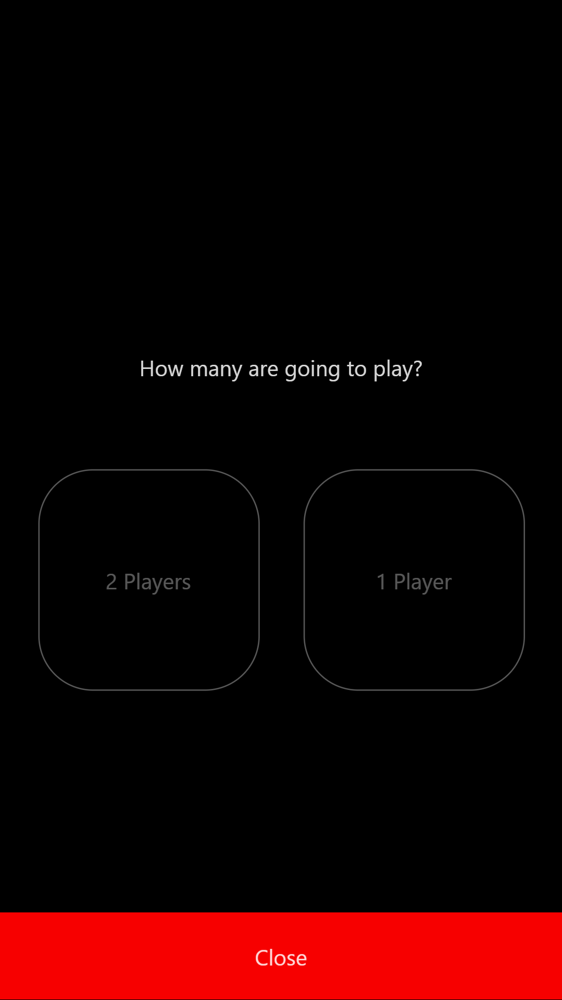

[![License][license-image]][license-url]

[license-url]: https://opensource.org/licenses/MIT
[license-image]: https://img.shields.io/npm/l/make-coverage-badge.svg

# MuffinsMastermind!   

## Jest code-coverage report

| Statements | Branches | Functions | Lines | Build Status |
| -----------|----------|-----------|-------| ------------ |
|  |  |  |  |  |

Muffin Mastermind is a good way for me to improve my features done in React js.
One player becomes the codemaker, the other the codebreaker. The codemaker chooses a pattern of four code pegs. Duplicates and blanks are allowed depending on player choice, so the player could even choose four code pegs of the same color or four blanks.

## Features

- Compatible with Mobile Screens  
- Solo play
- Friend vs Friend play :D. 
- Round History

## Instructions (Development)
Open a Terminal (CMD) and type the following: 

1. git clone https://github.com/SotoArmando/muffinsmastermind
2. cd muffinsmastermind
3. npm install
4. npm start 

- Clone the repo and run the app.
Live https://muffinsmastermind.herokuapp.com/

## How to run the test suite

- run test:
  > `npm run test`
- view test coverage:
  > `npm run test:coverage`

## Built With

- Javascript,
- React js,
- ES6
- React-Test
- Redux
- Babel

## Screenshots

|  |  |
| ------------- | ------------- |
|   |  |
|   |   |

## Author

- Github: [@SotoArmando](https://github.com/SotoArmando)
- Twitter: [@FeatSotoArmando](https://twitter.com/FeatSotoArmando)
- Linkedin: [@Armando Soto](https://www.linkedin.com/in/asotomelo/)

## 🤝 Contributing

Contributions, issues and feature requests are welcome!

Feel free to check the [issues page](issues/).

## Show your support

Give a ⭐️ if you like this project!

## Acknowledgments

- Hat tip to anyone whose code was used
- Inspiration
- etc

## 📝 License

This project is [MIT](lic.url) licensed.
